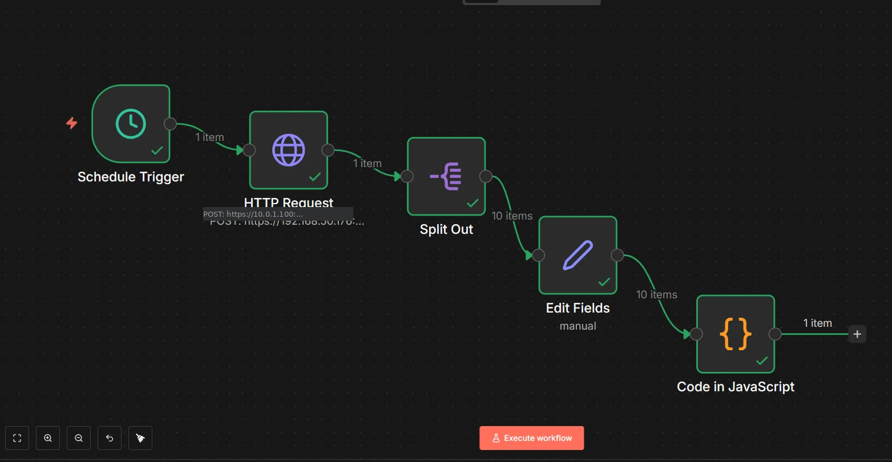
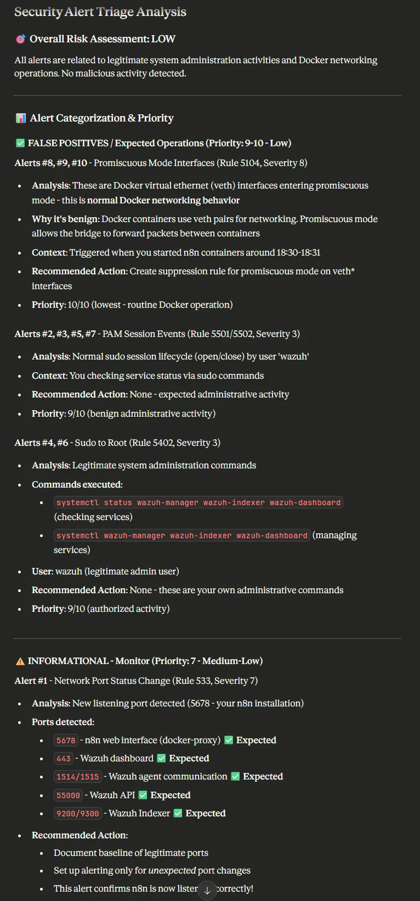

# Wazuh n8n Alert Triage System

An automated cybersecurity alert triage system that integrates Wazuh SIEM with n8n workflow automation and Claude AI for intelligent security alert analysis and prioritization.

## 🎯 Project Overview

This lab demonstrates the implementation of an automated Security Operations Center (SOC) workflow that:
- Collects security alerts from Wazuh SIEM
- Processes and formats alert data via n8n automation
- Analyzes alerts using Claude AI for intelligent triage
- Identifies false positives and prioritizes genuine threats
- Provides actionable recommendations for security response

**Purpose:** Portfolio project showcasing cybersecurity skills in SIEM deployment, workflow automation, and AI-assisted security operations.

## 🏗️ Architecture
```
┌─────────────────┐
│  Wazuh Server   │
│   (Ubuntu VM)   │
│                 │
│  • Manager      │
│  • Indexer      │
│  • Dashboard    │
└────────┬────────┘
         │
         │ HTTPS (Port 9200)
         │
┌────────▼────────┐
│   n8n Server    │
│  (Docker)       │
│                 │
│  • PostgreSQL   │
│  • n8n Engine   │
└────────┬────────┘
         │
         │ Formatted Alert Data
         │
┌────────▼────────┐
│  Claude AI      │
│ (Desktop App)   │
│                 │
│  • Analysis     │
│  • Triage       │
│  • Recommendations │
└─────────────────┘
```

## 🛠️ Technology Stack

### Infrastructure
- **Virtualization:** VirtualBox
- **Operating System:** Ubuntu 22.04 LTS Server
- **Container Platform:** Docker & Docker Compose

### Security & Monitoring
- **SIEM:** Wazuh 4.7 (All-in-One Installation)
  - Wazuh Manager (Agent management & analysis)
  - Wazuh Indexer/OpenSearch (Data storage & search)
  - Wazuh Dashboard (Visualization)

### Automation
- **Workflow Engine:** n8n (latest)
- **Database:** PostgreSQL 15
- **Orchestration:** Docker Compose

### AI Analysis
- **AI Platform:** Claude AI (Anthropic)
- **Implementation:** Claude Desktop App (manual analysis)
- **Future Enhancement:** Claude API (automated analysis)

## 📋 Prerequisites

### Hardware Requirements
- **VM Specifications:**
  - 8GB RAM minimum
  - 80GB disk space
  - 2+ CPU cores recommended
  - Network: Bridged adapter for external access

### Software Requirements
- VirtualBox (or similar hypervisor)
- Ubuntu 22.04 LTS Server ISO
- SSH client (PuTTY, Terminal, etc.)
- Modern web browser
- Claude Desktop App

## 🚀 Installation Guide

### 1. Wazuh Server Setup
```bash
# Update system
sudo apt update && sudo apt upgrade -y

# Install Wazuh All-in-One
curl -sO https://packages.wazuh.com/4.7/wazuh-install.sh
sudo bash ./wazuh-install.sh -a

# Save passwords (displayed at end of installation)
sudo tar -xf ~/wazuh-install-files.tar
cat ~/wazuh-install-files/wazuh-passwords.txt

# Verify services
sudo systemctl status wazuh-manager
sudo systemctl status wazuh-indexer
sudo systemctl status wazuh-dashboard
```

**Important Configuration Change:**

To allow n8n to query the Wazuh Indexer, modify the network binding:
```bash
# Edit Wazuh Indexer configuration
sudo nano /etc/wazuh-indexer/opensearch.yml

# Change:
# network.host: 127.0.0.1
# To:
# network.host: 0.0.0.0

# Restart indexer
sudo systemctl restart wazuh-indexer

# Verify it's listening on all interfaces
sudo ss -tlnp | grep 9200
```

### 2. n8n Installation
```bash
# Install Docker
sudo apt install -y docker.io docker-compose
sudo systemctl enable docker
sudo systemctl start docker
sudo usermod -aG docker $USER

# Log out and back in for group changes to take effect

# Create n8n directory
mkdir ~/n8n-wazuh
cd ~/n8n-wazuh

# Create docker-compose.yml (see config/ directory in this repo)
curl -o docker-compose.yml https://raw.githubusercontent.com/Code-JD/wazuh-n8n-alert-triage/main/config/docker-compose.yml

# Start n8n stack
docker-compose up -d

# Verify containers are running
docker ps
```

### 3. Access Interfaces

- **Wazuh Dashboard:** `https://<VM-IP>` (Default port 443)
  - Username: `admin`
  - Password: (from wazuh-passwords.txt)

- **n8n Interface:** `http://<VM-IP>:5678`
  - Configure during first access

## 🔄 Workflow Configuration

### n8n Workflow: Alert Retrieval & Formatting

The workflow consists of 5 nodes:

#### 1. Schedule Trigger
- **Purpose:** Automatically triggers workflow execution
- **Configuration:** Every 5 minutes (adjustable)
- **Use Case:** Continuous monitoring or on-demand execution

#### 2. HTTP Request (Wazuh Query)
- **Purpose:** Query Wazuh Indexer for recent alerts
- **Configuration:**
  - Method: POST
  - URL: `https://<VM-IP>:9200/wazuh-alerts-*/_search`
  - Authentication: Basic Auth (admin credentials)
  - SSL Verification: Disabled (self-signed cert)
  - Body:
```json
    {
      "query": {
        "match_all": {}
      },
      "size": 10,
      "sort": [
        {
          "timestamp": {
            "order": "desc"
          }
        }
      ]
    }
```

#### 3. Split Out
- **Purpose:** Convert single response into individual alert items
- **Configuration:** Split `hits.hits` array
- **Result:** 10 separate items (one per alert)

#### 4. Edit Fields
- **Purpose:** Extract relevant fields from nested JSON
- **Fields Extracted:**
  - `rule_id`: Alert rule identifier
  - `rule_description`: Human-readable alert description
  - `rule_level`: Severity level (0-15)
  - `agent_name`: Source system/agent
  - `timestamp`: Event timestamp
  - `full_log`: Complete log entry

#### 5. Code (Formatter)
- **Purpose:** Format alerts into readable text report
- **Output:** Structured text suitable for AI analysis
- **JavaScript Code:** (see workflow file)

## 🤖 Claude AI Analysis

### Manual Analysis Process

1. **Execute n8n workflow** (click "Test workflow")
2. **View Code node output** in n8n interface
3. **Copy formatted alert text**
4. **Open Claude Desktop App**
5. **Paste alerts with analysis prompt:**
```
I'm building a security alert triage system. Please analyze these Wazuh security alerts and provide:

1. Overall risk assessment (High/Medium/Low)
2. Which alerts require immediate attention
3. Which are likely false positives or normal operations
4. Recommended actions for each alert type
5. Priority ranking (1-10, with 1 being most urgent)

[Paste alert data here]
```

### Example Analysis Results

Claude AI successfully identified:
- ✅ **False Positives:** Docker veth interface promiscuous mode (normal container networking)
- ✅ **Benign Activity:** Legitimate sudo sessions and administrative commands
- ✅ **Informational Alerts:** Expected port openings (n8n on 5678)
- ✅ **Context-Aware Triage:** Correlated multiple alerts to single admin session
- ✅ **Actionable Recommendations:** Suggested suppression rules and baseline documentation

**Key Insight:** High-severity alerts (level 8) can be false positives when environmental context (Docker operations) is properly understood.

## 📊 Results & Key Findings

### Alert Statistics (Sample Run)
- **Total Alerts Analyzed:** 10
- **False Positives Identified:** 7 (70%)
- **Legitimate Admin Activity:** 3 (30%)
- **Actual Threats:** 0 (0%)

### Triage Categories
1. **Priority 10 (Lowest):** Docker networking operations
2. **Priority 9:** Routine PAM sessions and authorized sudo commands
3. **Priority 7:** Informational port changes (baseline establishment)

### Performance Metrics
- **Alert Retrieval Time:** <2 seconds
- **Data Processing Time:** <1 second
- **AI Analysis Time:** ~10-15 seconds (manual)
- **Total Workflow Execution:** ~20 seconds

## 🎓 Skills Demonstrated

### Technical Skills
- ✅ SIEM deployment and configuration (Wazuh)
- ✅ Linux system administration (Ubuntu Server)
- ✅ Docker containerization and orchestration
- ✅ API integration and authentication
- ✅ Workflow automation (n8n)
- ✅ JSON data parsing and transformation
- ✅ AI/LLM integration for security analysis

### Security Operations Skills
- ✅ Alert correlation and analysis
- ✅ False positive identification
- ✅ Context-aware threat assessment
- ✅ Baseline security posture establishment
- ✅ Risk prioritization methodology
- ✅ Incident response recommendations

### Soft Skills
- ✅ Technical documentation
- ✅ Problem-solving and troubleshooting
- ✅ Project planning and execution
- ✅ Cost-benefit analysis (manual vs. API)

## 🔮 Future Enhancements

### Phase 1: Expanded Monitoring
- [ ] Deploy Wazuh agents to additional systems (Windows PC, Ubuntu laptop)
- [ ] Generate diverse security events (failed logins, file changes, network scans)
- [ ] Create custom Wazuh rules for lab-specific scenarios

### Phase 2: Automation
- [ ] Integrate Claude API for automated analysis
- [ ] Implement automatic alert categorization
- [ ] Add severity-based filtering (only process level 7+ alerts)
- [ ] Create email/Slack notifications for high-priority alerts

### Phase 3: Advanced Features
- [ ] Build custom dashboard for triage results
- [ ] Implement alert enrichment (threat intel integration)
- [ ] Add automated response actions (block IPs, isolate agents)
- [ ] Create historical trend analysis and reporting

### Phase 4: Cloud Migration
- [ ] Deploy infrastructure to AWS (EC2, RDS)
- [ ] Implement proper secrets management (AWS Secrets Manager)
- [ ] Add SSL/TLS with valid certificates
- [ ] Scale for production workloads

## 📁 Project Structure
```
wazuh-n8n-alert-triage/
├── README.md                          # This file
├── config/
│   └── docker-compose.yml             # n8n container configuration
├── scripts/
│   └── cleanup-lab.sh                 # Environment cleanup script
├── workflows/
│   └── wazuh-alert-retrieval.json     # n8n workflow export
├── docs/
│   ├── installation-guide.md          # Detailed setup instructions
│   ├── troubleshooting.md             # Common issues and solutions
│   └── architecture-diagram.png       # Visual architecture
└── screenshots/
    ├── wazuh-dashboard.png
    ├── n8n-workflow.png
    ├── n8n-code-output.png
    └── claude-analysis.png
```

## 🐛 Troubleshooting

### Common Issues

**Issue: Cannot access Wazuh Indexer from n8n**
- **Solution:** Ensure Wazuh Indexer is listening on `0.0.0.0:9200` (not `127.0.0.1`)
- Verify with: `sudo ss -tlnp | grep 9200`

**Issue: n8n container in restart loop**
- **Cause:** Missing `N8N_ENCRYPTION_KEY` environment variable
- **Solution:** Add encryption key to docker-compose.yml

**Issue: Authentication failures**
- **Solution:** Reset admin password using Wazuh password tool
- Verify credentials in wazuh-passwords.txt file

**Issue: "Connection refused" when testing workflow**
- **Check:** Docker containers are running (`docker ps`)
- **Check:** Firewall isn't blocking ports (`sudo ufw status`)
- **Check:** Services are healthy (`docker logs n8n`)

## 💰 Cost Analysis

### Infrastructure Costs
- **Hardware:** $0 (existing equipment)
- **Software:** $0 (all open source)
- **Total Infrastructure:** $0/month

### AI Analysis Costs
- **Current Implementation:** $0 (Claude Desktop App - manual)
- **API Automation:** ~$2-5/month (estimated for lab usage)
- **Production Scale:** $10-30/month (with rate limits)

### Cost Optimization Strategies
- Manual execution for development/testing
- Schedule-based execution during specific hours
- API rate limiting and budget caps
- Batch processing alerts instead of real-time

## 📚 Learning Resources

### Technologies Used
- [Wazuh Documentation](https://documentation.wazuh.com/)
- [n8n Documentation](https://docs.n8n.io/)
- [Docker Documentation](https://docs.docker.com/)
- [Claude AI Documentation](https://docs.anthropic.com/)

### Related Concepts
- SIEM fundamentals and log analysis
- Security orchestration, automation, and response (SOAR)
- Threat intelligence and alert correlation
- Incident response workflows
- DevSecOps practices

## 🤝 Contributing

This is a personal portfolio project, but feedback and suggestions are welcome!

- Report issues via GitHub Issues
- Suggest improvements via Pull Requests
- Share your own implementations and modifications

## 📝 License

This project is open source and available for educational purposes.

## 👤 Author

**JD**
- GitHub: [@Code-JD](https://github.com/Code-JD)
- Project: Cybersecurity Portfolio Development
- Goal: Remote cybersecurity position

## 🙏 Acknowledgments

- **Wazuh** team for excellent open-source SIEM
- **n8n** community for powerful automation platform
- **Anthropic** for Claude AI capabilities
- **OpenSearch** project for search and analytics engine

---

## 📸 Screenshots

### Wazuh Dashboard

*Wazuh interface showing security events and system status*

### n8n Workflow

*Complete alert retrieval and formatting workflow*

### Formatted Alerts

*Clean, structured alert data ready for analysis*

### Claude AI Analysis

*AI-powered triage with risk assessment and recommendations*

---

**Last Updated:** January 6, 2026
**Status:** Active Development
**Version:** 1.0 - Manual Analysis Implementation
